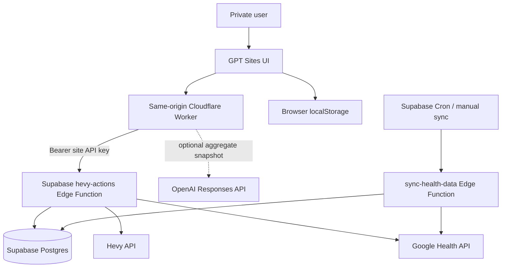

# Tong Fit — Project Master

> Canonical product and engineering reference for the Tong Fit AI Health Portal.
>
> Last verified: 3 October 2026 (Asia/Bangkok)

## 1. Product Summary

Tong Fit is a private, single-user AI health and fitness portal. It combines Google Health data and Hevy training history to answer four practical questions:

1. How is my health changing?
2. How recovered am I?
3. How is my training progressing?
4. What should I do next?

The product behaves like a **fitness coach, but nerdy**: concise recommendations first, followed by the evidence, time range, and confidence behind them.

Tong Fit provides wellness and training guidance. It is not a medical device and must not diagnose, treat, or present uncertain inferences as medical facts.

### Production

- Site: <https://tong-fit-ai-health.palm20052540.chatgpt.site/>
- Hosting: GPT Sites, owner-private
- Sites project ID: `appgprj_6abb647b32d88191bd344fa93a8675ca`
- Supabase project ref: `wgolwcojpqydgtlfyjko`
- Primary timezone: `Asia/Bangkok`
- UI language: English
- Intended user count: one

## 2. Current Product Surface

The portal has four bottom-navigation tabs.

### Health

- AI-style health summary embedded at the top of the page
- Steps, resting heart rate, weight, sleep, and active-zone-minute metrics
- Time ranges: 7D, 30D, 6M, and 1Y
- Health trend chart
- Body-composition section
- Goal-physique configuration and progress photos

### Recovery

- Recovery summary using HRV, sleep, resting heart rate, and training load
- Evidence row and recovery trend chart
- Recovery-driver list
- Guidance uses trends and personal baselines rather than a single reading

### Training

- Training summary for the selected range
- Time ranges: 7D, 30D, 6M, and 1Y
- Multi-select muscle groups
- Aggregated volume, hard sets, average RPE, strength change, frequency, and last-trained date
- Exercise-level estimated 1RM trends, top sets, recent momentum, and PR indicators
- Workout timeline
- Next-session load and rep recommendation
- Charts show only dates with recorded sessions
- Combined muscle selections deduplicate workouts when calculating aggregate volume and frequency

### Coach

- Adaptive daily brief combining Health, Recovery, and Training
- Ranked cross-signal priorities
- One next-best action with prescription, explanation, and confidence
- Evidence-coverage summary
- Link into the next-session recommendation flow
- Wellness disclaimer

Coach currently has two operating modes:

1. **Evidence Engine** — deterministic reasoning from live aggregate data; always available.
2. **Model-generated mode** — optional OpenAI Responses API output; enabled only when `OPENAI_API_KEY` is configured on the Site.

The UI must state which mode produced the result. Never represent deterministic fallback text as model-generated output.

## 3. User Configuration

Configuration is stored locally in the browser under `tong-fit:settings:v1`.

Current sections:

- Goals: primary goal, duration, target weight, training frequency, and focus exercises
- Training preferences: training days, equipment, style, rest days, RPE limits, and weekly set target
- Personal context: age, height, limitations, previous injuries, and precautions
- Analytics: unit, baseline length, comparison mode, and featured metrics
- Goal physique: free-text physique description and progress photos

Settings are browser-local. They are not currently synchronized across devices or persisted in Supabase.

## 4. System Architecture



### Frontend

- React `19.1.1`
- React DOM `19.1.1`
- Vite `8.0.16`
- Mobile-first layout with a maximum app width of 440 px
- Plain CSS design system in `src/styles.css`
- No client-side router; tab state is held in React and persisted to localStorage
- Live payloads are cached in memory by day range for the current session

### GPT Sites Worker

`worker/index.js` is the same-origin backend-for-frontend.

Responsibilities:

- Serve the static React bundle
- Keep upstream credentials out of browser code
- Enforce the optional `ALLOWED_USER_EMAIL` check
- Proxy dashboard, sync, freshness, and routine requests to Supabase
- Call the OpenAI Responses API for Coach when configured
- Return JSON with `Cache-Control: no-store`

The browser must call only same-origin `/api/*` routes. It must never call Supabase with a private API key or call OpenAI directly.

### Supabase

Supabase owns persistence, external-source synchronization, aggregation, and API authorization.

Edge Functions:

- `oauth-callback` — completes Google OAuth and stores tokens
- `sync-health-data` — refreshes tokens and synchronizes Google Health data
- `hevy-actions` — serves Custom GPT, plugin, and portal API routes; also manages Hevy routines

All three functions currently set `verify_jwt = false` in `supabase/config.toml` and perform explicit application-level authorization. Do not remove the custom authorization checks when changing `verify_jwt`.

### Data Sources

- Google Health API: activity, sleep, heart rate, HRV, resting heart rate, exercise sessions, active-zone minutes, and weight
- Hevy API: workouts, exercises, sets, RPE, routines, and body measurements
- Progress photos: browser-local storage at present

## 5. Request and Data Flow

### Dashboard read

1. `App.jsx` converts the selected range to 7, 30, 180, or 365 days.
2. `src/portalData.js` requests `GET /api/dashboard?days=N`.
3. The Site Worker calls `GET /v1/portal-dashboard?days=N` on `hevy-actions`.
4. Supabase returns one compact aggregate payload.
5. `buildLiveView()` converts that payload into UI-ready view data.
6. React components derive charts, insights, and recommendations from the view.

One compact dashboard request per range is preferred over many widget-level queries.

### Manual synchronization

1. The user taps **Sync now**.
2. The browser calls `POST /api/sync`.
3. The Worker calls `POST /v1/sync-missing-data`.
4. Supabase applies per-source cooldown and atomic sync guards.
5. The app refreshes the currently selected dashboard range.

Do not sync Hevy or Google Health on every page load. Synchronization is manual or scheduled so repeated browsing does not waste Supabase or external API usage.

### Coach generation

1. The frontend builds a small aggregate snapshot from the current live view.
2. It calls `POST /api/coach`.
3. If `OPENAI_API_KEY` is absent, the Worker returns `mode: "rules"` and the Evidence Engine remains active.
4. If the key is present, the Worker sends the aggregate snapshot to the OpenAI Responses API with `store: false`.
5. The response must match the expected Coach JSON structure.
6. Invalid, unavailable, or aborted model requests fall back to the Evidence Engine.

Only aggregated signals should be sent to the model. Do not send OAuth tokens, API keys, raw health records, email addresses, or unrelated personal data.

## 6. API Surface

### Browser-to-Site routes

| Method | Route | Purpose |
|---|---|---|
| `GET` | `/api/dashboard?days=N` | Fetch one aggregate portal payload |
| `POST` | `/api/sync` | Synchronize missing Hevy and Google Health data |
| `GET` | `/api/status` | Read data freshness |
| `GET` | `/api/routines` | List Hevy routines |
| `GET` | `/api/routines/:id` | Read one routine |
| `POST` | `/api/routines` | Create a routine |
| `PUT` | `/api/routines/:id` | Update a routine |
| `POST` | `/api/coach` | Generate or negotiate Coach mode |

### Compact Supabase routes

| Method | Route | Purpose |
|---|---|---|
| `GET` | `/v1/daily-state` | Current health and recovery state |
| `GET` | `/v1/health-recap?days=N` | Aggregate health recap |
| `GET` | `/v1/workout-progress?days=N` | Aggregate workout progress |
| `GET` | `/v1/data-freshness` | Source freshness |
| `GET` | `/v1/portal-dashboard?days=N` | Portal payload |
| `POST` | `/v1/sync-missing-data` | Guarded data sync |

Legacy Custom GPT Action routes remain available for backward compatibility. New portal work should prefer `/v1` routes.

## 7. Data Model

Important tables include:

- `health_tokens` — Google OAuth tokens per user
- `health_metrics` — flexible source records stored as `jsonb`
- `sync_logs` — sync attempts and status
- `hevy_workouts` and related Hevy tables — workout history and sets
- `workout_health_summaries` — measured physiology contained within workout windows

RLS is enabled on user-owned health tables. Authenticated reads must be scoped to `auth.uid() = user_id`. Edge Functions use the service role only on the server.

### Time and units

- Persist timestamps in an unambiguous timezone-aware format.
- Render user-facing dates in `Asia/Bangkok`.
- Default weight unit is kilograms.
- Estimated 1RM is directional guidance, not a maximum-attempt prescription.
- Source-reported calories may be shown as trend context but must not be treated as a precise caloric-deficit measurement.

## 8. Environment and Secrets

Never commit real secrets. `.env`, `.dev.vars`, generated build secrets, and service credentials must remain outside Git.

### Local development

Common local variables:

- `SUPABASE_URL`
- `SUPABASE_SERVICE_ROLE_KEY`
- `SUPABASE_PROJECT_REF`
- `SUPABASE_ACCESS_TOKEN`
- `GOOGLE_CLIENT_ID`
- `GOOGLE_CLIENT_SECRET`
- `GOOGLE_REDIRECT_URI`
- `GOOGLE_OAUTH_STATE`
- `HEALTH_USER_ID`
- `HEALTH_SOURCE`
- `SYNC_SHARED_SECRET`
- `SYNC_WINDOW_DAYS`

### GPT Sites production environment

- `AI_HEALTH_API_URL`
- `AI_HEALTH_PLUGIN_API_KEY` — contains the dedicated Site API key value
- `ALLOWED_USER_EMAIL` — recommended defense in depth
- `OPENAI_API_KEY` — optional; enables model-generated Coach output
- `OPENAI_MODEL` — optional model override

The value stored as the Site's `AI_HEALTH_PLUGIN_API_KEY` should match the Supabase `AI_HEALTH_SITE_API_KEY`. Keep the Site key separate from the personal Codex plugin key.

### Supabase function secrets

The deployed functions may require:

- `SERVICE_ROLE_KEY`
- `GOOGLE_CLIENT_ID`
- `GOOGLE_CLIENT_SECRET`
- `GOOGLE_REDIRECT_URI`
- `GOOGLE_OAUTH_STATE`
- `HEALTH_USER_ID`
- `HEALTH_SOURCE`
- `SYNC_SHARED_SECRET`
- `HEVY_API_KEY`
- `HEVY_ACTIONS_API_KEY`
- `AI_HEALTH_PLUGIN_API_KEY`
- `AI_HEALTH_SITE_API_KEY`

Use different credentials for the Custom GPT, personal plugin, and Site whenever practical.

## 9. Repository Map

```text
AI Health/
├── .openai/hosting.json          # Sites project binding only
├── src/
│   ├── App.jsx                   # App composition, loading, tabs, sheets
│   ├── CoachView.jsx             # Adaptive Coach and Evidence Engine
│   ├── TrainingView.jsx          # Training analytics and exercise sheets
│   ├── healthView.js             # API payload → live UI view model
│   ├── portalData.js             # Browser API client
│   ├── components.jsx            # Shared UI primitives
│   ├── DetailSheets.jsx          # Workout, exercise, and recommendation sheets
│   ├── SettingsSheets.jsx        # Configuration UI
│   ├── settings.js               # Defaults and local persistence
│   ├── icons.jsx                 # Shared SVG icon system
│   └── styles.css                # Design tokens and responsive CSS
├── worker/index.js               # Sites Worker and private API proxy
├── supabase/
│   ├── config.toml               # Edge Function verification config
│   ├── functions/
│   │   ├── hevy-actions/
│   │   ├── oauth-callback/
│   │   └── sync-health-data/
│   └── migrations/               # Database history
├── scripts/                      # Build, deploy, OAuth, and sync helpers
├── hevy-gpt-actions.openapi.yaml # Custom GPT Actions contract
├── vite.config.js
└── package.json
```

## 10. Coding Guidelines

### General

- Prefer the smallest change that preserves the current architecture.
- Keep business calculations in pure functions, not inside JSX.
- Derive display state with `useMemo` when the calculation is non-trivial.
- Do not duplicate server data in React state unless the user can edit it.
- Use functional state updates when the next state depends on the previous state.
- Keep `App.jsx` as composition and orchestration; move feature-specific rendering into focused modules.
- Reuse existing components and CSS tokens before adding a new component family.
- Do not silently invent health values, sessions, dates, or confidence scores.

### Data calculations

- Every insight must identify its time range.
- Show only dates that have source data.
- Deduplicate workouts when combining muscle groups.
- Do not average percentages when a weighted calculation is required.
- Distinguish missing data from a true zero.
- Preserve raw source timestamps; do not infer set or exercise timestamps.
- Separate observation, inference, and recommendation.
- Attach confidence to recommendations that depend on incomplete coverage.

### AI and wellness guidance

- Use the supplied aggregate data only.
- Never diagnose or prescribe medical treatment.
- Avoid causal claims unless the data design supports them.
- Phrase correlations as possibilities: “may be associated with,” not “caused by.”
- Provide one clear action before secondary detail.
- Include evidence and confidence.
- Fall back safely when the model is unavailable or returns invalid output.
- Never allow model text to alter credentials, authorization, or server configuration.

### Accessibility

- Target WCAG 2.2 AA.
- Use semantic headings and landmarks.
- All icon-only buttons require an accessible label.
- Interactive pills use `aria-pressed` and a group label.
- Bottom sheets must trap focus, close on Escape, restore focus, and prevent background scrolling.
- Maintain a minimum 44 × 44 px touch target where practical.
- Never rely on color alone to communicate status.
- Respect `prefers-reduced-motion` for new animation.

### Styling

- Preserve the clean, techy white/blue/orange visual direction.
- Keep the mobile-first 440 px app shell.
- Use existing CSS custom properties for color, spacing, and surfaces.
- Prefer open sections and lists over nested card grids.
- Avoid adding decorative badges, gradients, or icons without a functional purpose.
- Check both narrow mobile and desktop-hosted mobile-shell layouts.

### Security

- Never expose `SUPABASE_SERVICE_ROLE_KEY`, Google secrets, Hevy keys, Site API keys, or OpenAI keys to the browser.
- Never place runtime secrets in `.openai/hosting.json`.
- Validate request methods, paths, ranges, and JSON bodies at the Worker boundary.
- Keep the Site owner-private unless the user explicitly changes its audience.
- Keep `ALLOWED_USER_EMAIL` aligned with the account opening the private Site.
- Use `Idempotency-Key` for routine writes.
- Do not log tokens, authorization headers, raw health payloads, or model prompts containing sensitive data.

## 11. Development Workflow

### Install and run

```powershell
npm install
npm run dev
```

Default local URL:

```text
http://127.0.0.1:5173/
```

### Required checks

```powershell
npm run check
npm run build
git diff --check
```

`npm run build` performs:

1. Clean `dist`
2. Build the Worker
3. Build the React client
4. Remove build-time secrets
5. Generate the GPT Sites-compatible server entrypoint and hosting metadata

### Browser QA

Before publishing a visible change, verify:

- Correct production or local URL and page title
- Meaningful content renders; no framework error overlay
- No relevant console warnings or errors
- Health, Recovery, Training, and Coach navigation
- At least one interaction affected by the change
- Live-data, loading, error, empty, and fallback behavior as applicable
- Mobile layout, fixed bottom navigation, sheets, focus, and scrolling

For data bugs, inspect the API response and source coverage before changing UI code.

## 12. Deployment

### Supabase

Supabase changes are deployed separately from the Site.

```powershell
npm run check
supabase functions deploy <function-name> --project-ref wgolwcojpqydgtlfyjko
```

Use migrations for persistent database changes. Review RLS, grants, and database advisors before considering a schema change complete.

### GPT Sites

The Site source is bound through `.openai/hosting.json`. Publishing requires:

1. Build and validate the exact source state.
2. Push that state to the Site source repository.
3. Package the matching `dist` archive.
4. Save a Site version using the pushed commit SHA and archive.
5. Deploy the saved version privately.
6. Confirm deployment status and production URL.

Updating Site environment variables does not update a running deployment by itself. Deploy a saved version after an environment revision so the new values take effect.

## 13. Error Handling and Fallbacks

### Frontend

- Dashboard failure: show sample data plus the returned error message.
- Coach failure: retain the deterministic Evidence Engine.
- Sync failure: show a dedicated bottom sheet.
- Missing metric: display an em dash, not zero.

### Worker status conventions

- `401`/`403`: authentication or allowed-user problem
- `402`: Supabase usage limitation; explain that live data will resume when service is restored
- `502`: upstream health API or OpenAI failure
- `503`: required Worker configuration missing

### Authentication troubleshooting order

1. Confirm whether `/api/dashboard` fails before or inside the Site Worker.
2. Check GPT Sites Worker logs.
3. Confirm the Site is active and the current account is allowed.
4. Confirm `ALLOWED_USER_EMAIL` matches the authenticated Site visitor.
5. Confirm the Site `AI_HEALTH_PLUGIN_API_KEY` matches Supabase `AI_HEALTH_SITE_API_KEY`.
6. Call the Supabase endpoint directly with an authorized server-side credential.
7. Inspect Supabase Edge Function invocation logs.

Do not rotate or replace credentials until the failing layer has been identified.

## 14. Current Operational Note

As of 3 October 2026, the private Site has reproduced a same-origin `/api/dashboard` `401` while the direct Supabase dashboard endpoint returned `200`. No corresponding Site Worker error event was recorded. This indicates the request can be rejected by the private Site authorization layer before reaching application code, commonly because of a stale or missing browser authentication session.

First recovery step: reopen or refresh the Site with an active ChatGPT session. If the issue persists, inspect the Sites auth client/access policy before modifying Supabase credentials.

## 15. Known Limitations

- Single-user architecture
- Settings and photos are local to one browser
- OpenAI-generated Coach output is disabled until a Site-side `OPENAI_API_KEY` is configured
- No medical diagnosis or clinical decision support
- No automatic routine mutation without explicit user review
- Estimated 1RM and progression guidance depend on Hevy logging quality and RPE coverage
- OAuth tokens are stored in protected database columns rather than per-token Vault references
- Historical source coverage varies by metric

## 16. Near-Term Roadmap

1. Stabilize GPT Sites private-session authentication for `/api/*` requests.
2. Configure the OpenAI API key through the approved Site secret flow.
3. Validate model-generated Coach output against the Evidence Engine.
4. Add recommendation outcome tracking: suggested action → performed action → result.
5. Add weekly review and progress forecasting with explicit confidence bands.
6. Add physique-photo comparison with conservative, non-diagnostic language.
7. Move settings and photo metadata to private Supabase storage if cross-device use becomes necessary.

## 17. Definition of Done

A change is complete only when:

- The requested behavior is implemented.
- Calculations use real source data or are clearly labeled sample data.
- Security boundaries remain intact.
- `npm run check`, `npm run build`, and `git diff --check` pass.
- The affected flow is verified in a browser.
- Console errors are resolved or explicitly documented.
- Production is deployed when the request changes the Site.
- This master document is updated when architecture, environment keys, routes, major features, or operational constraints change.

